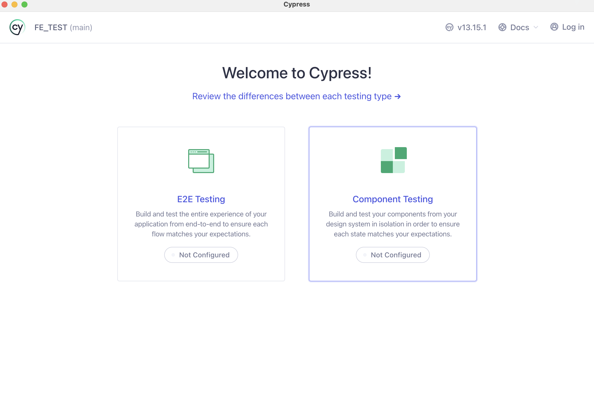
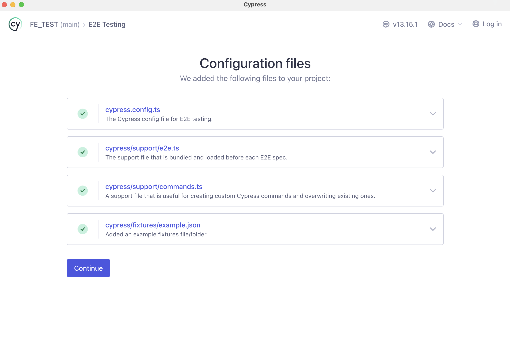
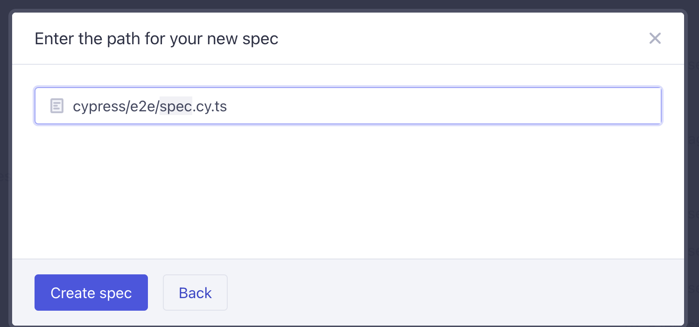
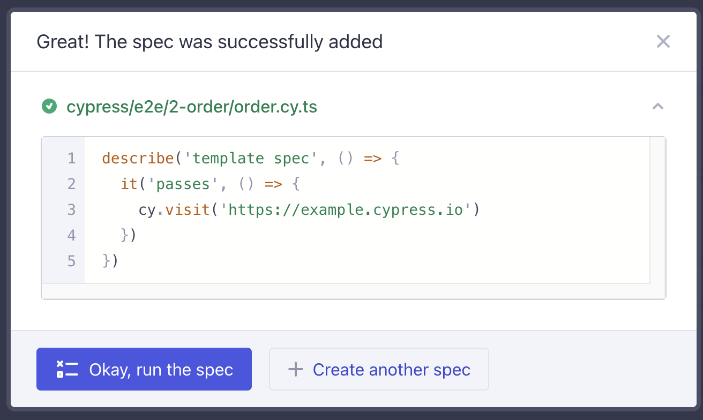

## Cypress를 활용한 테스트코드 작성

> Jest의 경우 유닛테스트를 위해 만들어진 테스트도구지만,   
사실상 프론트엔드에서 유닛테스트의 개념이 모호하다고 생각   
왜냐면 모듈을 정의하거나 함수를 테스트하는 것도 크게 의미가 없다고 생각

Cypress : Javascript component Testing   
e2e테스트이기 때문에 좀 더 프론트엔드 성격에 적합하다고 생각

### Cypress 설치 및 환경설정

- Cypress 설치

```jsx
npm install --save-dev cypress
```

- `package.json`에 cypress 실행 명령어 추가
 
- **Cypress 실행**

|||
|---|---|
|||
|||

- 자동으로 cypress 디렉토리가 구성


- 추가

- 테스트 구동 시 사용자가 직접 사용하는 화면을 같이 보여줘서 좀 더 프론트엔드 테스트에 적합하다고 느껴짐!

### 테스트 코드 작성

- 기본 문법
    - jest와 다르게 `it`을 사용하여 작성

```jsx
describe("환경설정 테스트", () => {
    it("환경설정 테스트", () => {
        // given
        // when
        // then     
    })
})
```

- **로그인 로직**

- `data-cy` 속성을 사용해서 cypress가 태그를 가져오도록 구현
- as를 통해 이후 코드에는 emailInput, passwordInput 를 사용

```jsx
cy.get('[data-cy=emailInput]').as('emailInput');
cy.get('[data-cy=passwordInput]').as('passwordInput');
``` 

- `val`를 통해 입력한 값과 같은지 검증
- 이때 제대로 된 검증을 위해 *test@email.com* 와 *password*를 하드코딩 해야함 (>당연함)

```jsx
cy.get("@emailInput").invoke("val").should("eq", "test@email.com");
cy.get("@passwordInput").invoke("val").should("eq", "password");
```

***실제로 HTTP 통신이 일어나는 경우의 테스트코드 작성***

- jest에서는 `nock`을 통해서 mocking을 했었음
- cypress의 경우 **별도의 패키지 없이 request 처리가 가능**

    - `intercept`를 통해 버튼 클릭 전에 가로챌 수 있음

    ```jsx
    cy.intercept(
        {
        method: "POST",
        url: "/user/login",
        },
        { token: "AUTH_TOKEN" } // response body 추가도 가능
    ).as("login");
    ```

<br/>

- **Cypress GUI 에서 테스트케이스 생성**

- 디렉토리에서 바로 폴더를 생성해도 되고,
- spec 바로 추가 가능

|||
|---|---|
|||
|||

<br/>

- **Cypress Typescript 설정**

> ts파일을 생성하면 `Cannot find name 'cy'`라는 에러가 발생


- 하지만 테스트 자체의 접근이나 구동은 잘 돌아감 !!


- Type error를 없애기 위해 `type` 패키지를 설치해야함

```jsx
npm install --save-dev @types/cypress
```

- tsconfig.json 설정 추가

```jsx
{
	...
	"types": ["cypress"],
	"include": ["src", "**/*.ts"],
	...
}
```

<br/>

- **cypress에서 fixture 활용**

- fixture를 사용하여 json 파일을 생성하여 불러올 수 있음
- 코드를 줄여주고 로직 가독성을 높여줌

```jsx
// fixture 사용 전

  it("cypress http 테스트입니다.", () => {
    cy.visit("/");

    cy.intercept(
      {
        method: "GET",
        url: "/ex/cypress",
      },
      [
        {
          id: 1,
          name: "example1",
        },
        {
          id: 2,
          name: "example1",
        }
        ...

      ]
    );

    cy.get("[data-cy=1]").should("be.visible").as("exampleBtn");
    cy.get("@exampleBtn").click();

    cy.url().should("include", "/ex1");
  });
  ```

- fixture를 선언하면 fixture에 있는 특정 값을 클릭하는 테스트를 구현할 수 있음

    - `cy.fixture` 사용
    - async await 도 가능!!

  ```jsx
  it("cypress http 테스트입니다.", () => {
    cy.visit("/");

    cy.intercept(
      {
        method: "GET",
        url: "/ex/cypress",
      },
      {
        fixture: "example-list.json",
      }
    );

    // fixture 사용
    cy.fixture("example-list.json").then((exampleList) => {
      cy.get(`[data-cy=${exampleList[0].id}]`)
        .should("be.visible")
        .as("exampleBtn");
      cy.get("@exampleBtn").click();

      cy.url().should("include", "/ex1");
    });
  })
  ```

