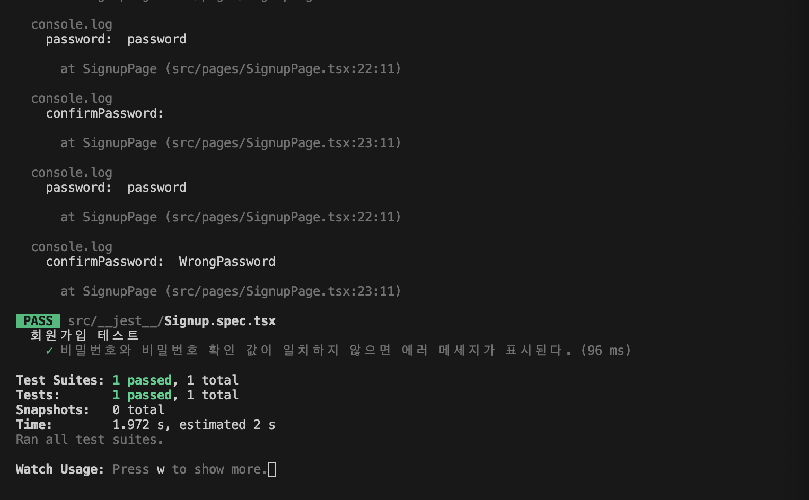
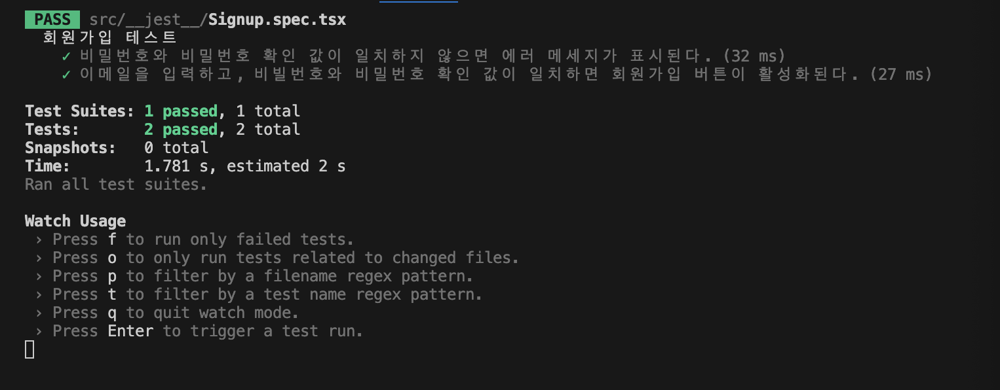
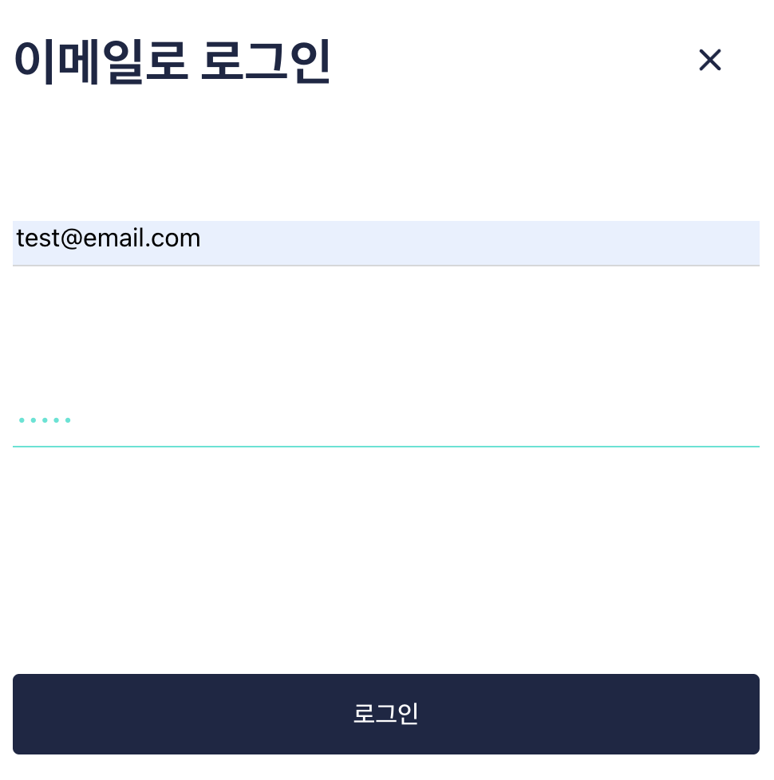
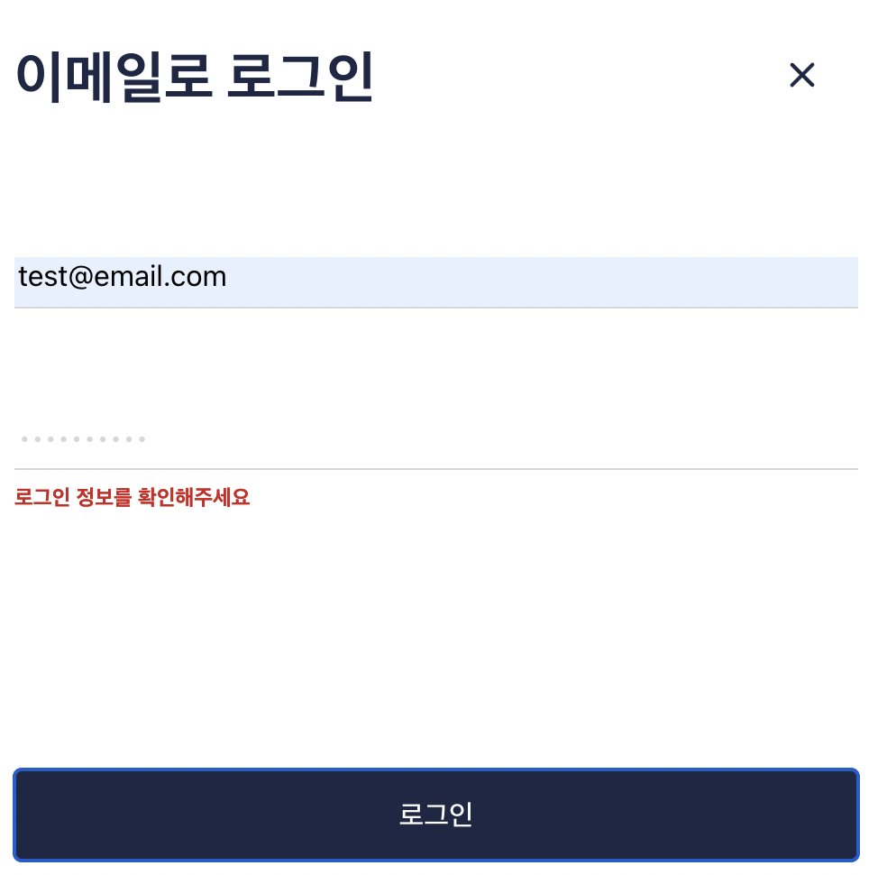
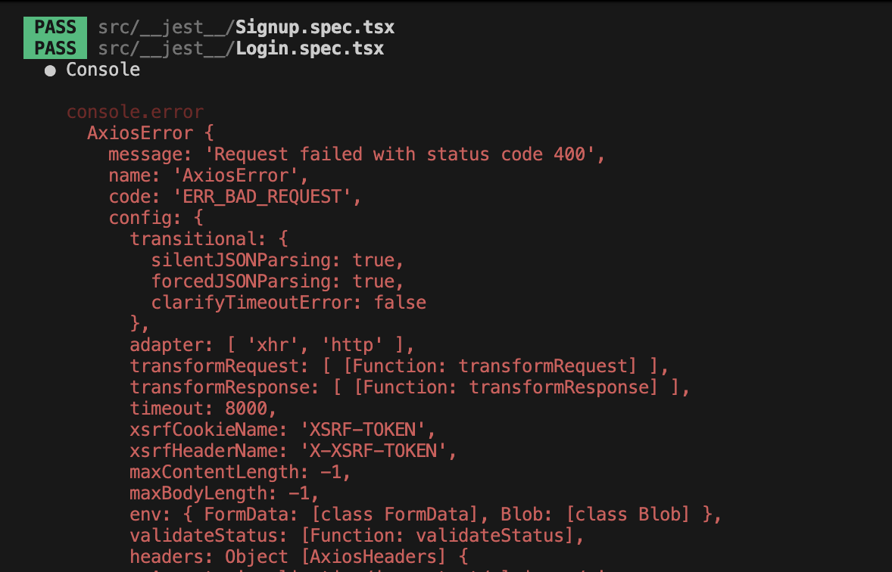

## Jest를 활용한 테스트코드 작성

### Jest 설치 및 환경설정

- Jest 설치

```jsx
npm install --save-dev jest @types/jest ts-jest jest-environment-jsdom @testing-library/react @testing-library/dom @testing-library/jest-dom
```

- Jest 환경설정

```jsx
// package.json
"test": "jest --watchAll",
...
"jest": {
    "preset": "ts-jest",
    "testEnvironment": "jest-environment-jsdom",
  },
```

### 테스트 코드 작성

- 기본 문법

```jsx
describe("환경설정 테스트", () => {
    test("환경설정 테스트", () => {
        // given
        // when
        // then     
    })
})
```

- **회원가입 로직**

|||
|---|---|
|||
|||


- `beforeEach()`를 사용하여 각각의 테스트 실행 전 필요한 부분을 먼저 실행하도록 처리
    - 회원가입 페이지를 랜더링하는 중복되는 부분을 따로 처리 


- `SignupPsge`에서 *react-router-dom* 랑 *react-query*를 사용
    - 실제 페이지 라우팅을 사용할 때처럼 `Provider`로 감싸줘야함

```jsx
// 그냥 이렇게 랜더하면 테스트 실행 시 에러가 난다 !
render(
      <SignupPage />
    );
```

```jsx
  beforeEach(() => {
    const routes = [
      {
        path: "/signup",
        element: <SignupPage />,
      },
    ];

    const router = createMemoryRouter(routes, {
      initialEntries: ["/signup"],
      initialIndex: 0,
    });

    render(
      <QueryClientProvider client={queryClient}>
        <RouterProvider router={router} />
      </QueryClientProvider>
    );
  });
```

> 비밀번호와 비밀번호 값이 일치하지 않으면 에러 메세지지 표시

- `fireEvent()`를 사용하여 **change 이벤트**를 발생시켜 `passwordInput`과 `confirmPasswordInput`에 값을 넣어줌
    - `<Lable/>`과 `<Input/>`을 htmlFor로 연결했음

```jsx
// 비밀번호와 비밀번호 확인에 각각 다른 값을 넣어 change 이벤트 발생시키기
fireEvent.change(passwordInput, { target: { value: 'password' } });
fireEvent.change(confirmPasswordInput, {
      target: { value: 'WrongPassword' },
    });
```



- 콘솔을 찍어서 값을 확인했다
    - 넣은 순서대로 값이 찍히는 것을 확인할 수 있음 !!

<br/>

> 이메일을 입력하고, 비빌번호와 비밀번호 확인 값이 일치하면 회원가입 버튼이 활성화된다.

- 페이지 랜더링 후, 값을 입력하기 전에 버튼이 비활성화 되어 있는지 먼저 확인

```jsx
const signupButton = screen.getByRole('button', { name: '회원가입' });
expect(signupButton).toBeDisabled();
```




<br/>

- **로그인 로직**

    ***실제로 HTTP 통신이 일어나는 경우의 테스트코드 작성***

|||
|---|---|
|||
|||

> 로그인에 실패하면 에러 메세지가 나타난다.

- 400에러가 발생했을 때(HTTP 통신 에러가 발생했을 때) 에러메세지를 띄움
    - `useLogin` 훅을 이용
    - `isError`를 사용하여 에러 처리

[리액트쿼리 테스팅 공식문서](https://tanstack.com/query/v4/docs/framework/react/guides/testing)

- 공식문서를 참고해보면 hook 자체를 모킹하기 보다는 hook을 결과를 처리하는 식으로 예제 코드가 나와있음!

```jsx
const { result } = renderHook(() => useLogin(), { wrapper });
await waitFor(() => result.current.isError); // 내 코드의 경우 isError로 처리
```

- 이렇게까지 작성하고 테스트 코드를 돌리면 에러가 난다.....

    - 왜냐면, 에러 메세지는 HTTP 호출을 한 다음에 isError를 확인해서 보여주는데
    - isError가 false이기 때문에, 사실상 HTTP 호출이 발생하지 않았기 때문에 무의미함

- 실제 사용자가 이용하는 것처럼 로그인 버튼을 활성화해서 클릭 이벤트를 발생시킴

```jsx
// 잘못된 이메일과 비밀번호 값을 던져서 클릭 이벤트 발생시킴
const loginButton = screen.getByRole('button', { name: '로그인' });
fireEvent.click(loginButton);
```

- 테스트는 잘 돌아갔고, 400에러를 발생하면서 콘솔에 에러가 출력!!



- axios에서 에러가 발생하기 때문에 콘솔에 에러가 찍힘
    - 리액트 쿼리에서는 로거 옵션을 추가해서 로깅을 끄는 것을 권장하더라
    - 테스트 환경에서는 로깅을 꺼라! 느낌

```jsx
const queryClient = new QueryClient({
  defaultOptions: {},
  logger: {
    log: console.log,
    warn: console.warn,
    // no more errors on the console for tests
    error: process.env.NODE_ENV === 'test' ? () => {} : console.error
  }
});
```

- 위의 방법 말고 mocking을 이용하는 방법도 있음
    - `beforeEach()`를 활용해서 console.error가 찍히면 아무것도 하지마라
    -  다 끝나면 원래대로 돌아가도록 하는 코드를 추가

```jsx
beforeEach(() => {
    jest.spyOn(console, 'error').mockImplementation(() => {});
  });

afterAll(() => {
    jest.restoreAllMocks();
  });
```

여기까지 작성하면 테스트를 돌릴 때마다 실제로 서버에 요청을 보내버림...   
-> **request 자체를 모킹해서 서버에서 bad request 응답이 온 것처럼 처리해야함**

- `nock` 패키지 사용

```
npm install --save-dev nock
```

공식문서의 JSON 활용법이 있음    
[nock 참고 문서](https://github.com/nock/nock)

```jsx
nock("서버 URL").post("/user/login/", {
        username: "wrong@email.com",
        password: "wrongPassword",
      })
    .reply(400, { msg: "NO_SUCH_USER" });
```

- 서버로 request가 가지 않도록 처리