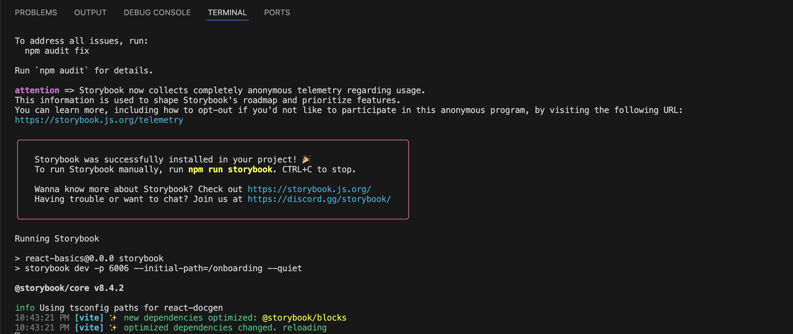
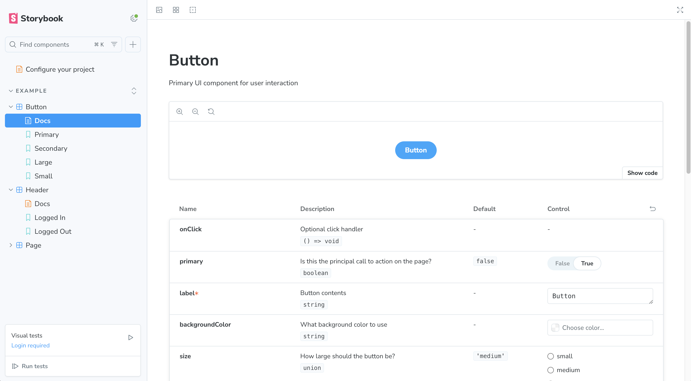
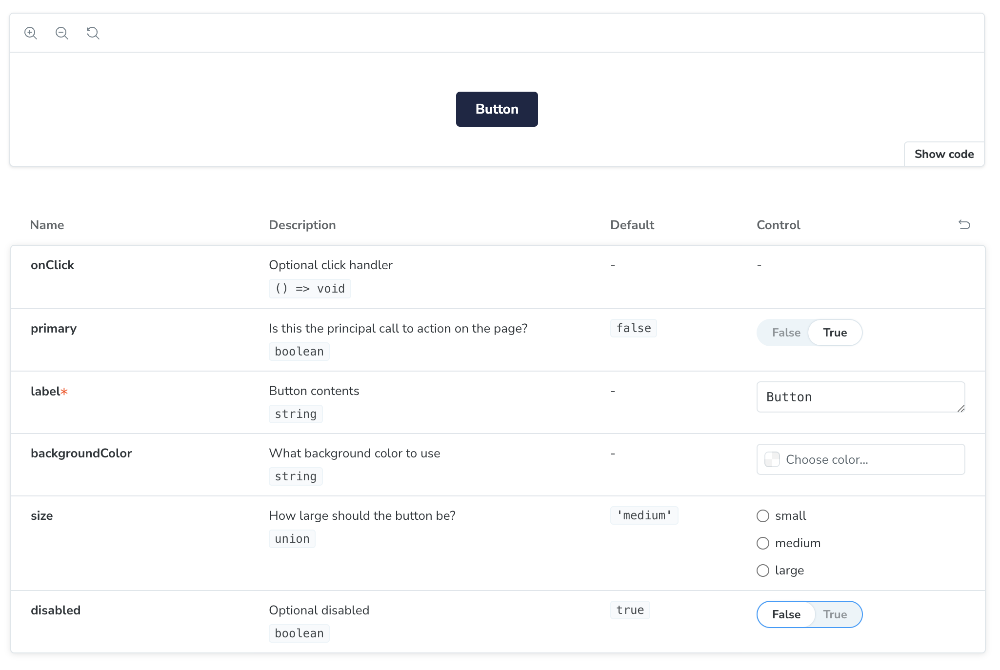
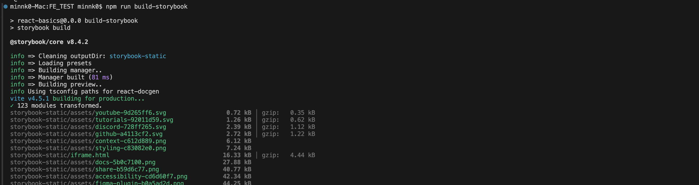
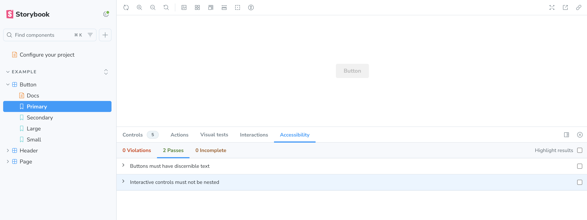
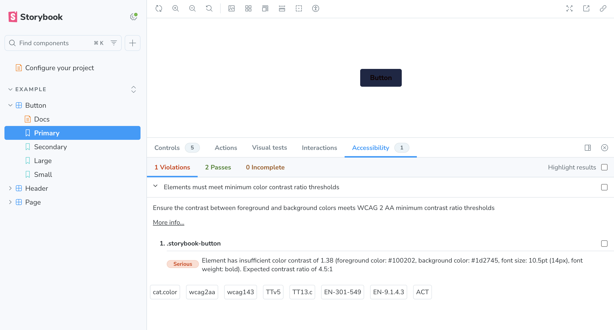

## Storybook을 활용한 UI 테스트

### Storybook 설치 및 환경설정

- Storybook 설치

공식문서에 패키지 매니저별로 명령어를 제공함

```jsx
npx storybook@latest init
```

> 📌  
`yarn`을 사용중이라면 꼭 `yarn berry`를 사용해야함  
`yarn1.x`는 처음 설치하고 구동할 때는 잘 돌아가는데 나중에 에러남 



설치 완료 😆



<br/>

### 스토리를 활용한 컴포넌트 작성

- 컴포넌트에 `margin`, `height`, `width` 등의 속성을 넣으면 재사용성이 떨어짐

- 기획과 디자인은 언제든지 수정될 수 있기 때문에
    - 재사용성이 높은 컴포넌트는 해당 컴포넌트만 보이도록 !
    - 간격 등은 `CSS selector`를 사용하는 것을 권장 !

> ButtonProps이 Name, 주석은 Description으로 표시

- ButtonProps에 `disabled` 속성 추가하기

```jsx
/** Optional disabled */
disabled?: boolean;
```

- optional이기 때문에 타입스크립트에서는 default 값을 추가

```jsx
/** Primary UI component for user interaction */
export const Button = ({
  primary = false, 
  disabled = true,  // 추가
  size = 'medium',
  backgroundColor,
  label,
  ...props
}: ButtonProps) => {
  const mode = primary ? 'storybook-button--primary' : 'storybook-button--secondary';
  return (
    <button
      type="button"
      className={['storybook-button', `storybook-button--${size}`, mode].join(' ')}
      style={{ backgroundColor }}
      disabled={disabled}   // 추가
      {...props}
    >
      {label}
    </button>
  );
};
```
- 스타일은 css파일에서 수정
    - `--primary`와 같은 경우는 사전에 App.css에 지정해놓은 컬러입니다!

```jsx
.storybook-button--primary {
  color: rgb(255, 255, 255);
  background-color: var(--primary);
}
.storybook-button--secondary {
  color: #333;
  background-color: var(--secondary);
  box-shadow: rgba(0, 0, 0, 0.15) 0px 0px 0px 1px inset;
}

.storybook-button:disabled{
  background-color: var(--mono-100);
  color: var(--mono-200);
}
```

- component 페이지에서 선언한 css 파일을 import

```jsx
import '../App.css';
```

> ⭐️ 스토리 문서는 새로고침으로 반영이 안되기 때문에 새로 실행해줘야 한다..!!

- 가장 아래에 `disabled` 옵션이 추가된 것을 확인할 수 있다



**스토리 폴더에 있지만 리액트 함수형 컴포넌트이기 때문에 그대로 가져다가 쓰면 된다 😆**

<br/>

### Storybook 배포

- 디자이너와의 소통을 위한 툴인데 매번 `npm run storybook`을 할 수는 없음

- 빌드 명령어 실행

```jsx
npm run build-storybook
```

- 새로운 폴더가 하나 만들어짐 (이 디렉토리 안에 배포할 수 있는게 만들어짐)



- 디렉토리를 그대로 실행

```jsx
npx http-server ./storybook-static
```

- 로컬에서 실행한 것이랑 똑같이 생겼다..!! (대신 이제 다른 사람들이 접근이 가능하겠지)
- 배포 버전은 AWS에 올린다거나 할 때는 테스트코드 배포랑 똑같은데 'build' 폴더 위치만 바꿔주면 된다

<br/>

### Storybook Accessibility Test (접근성 테스트)

[공식문서 튜토리얼](https://storybook.js.org/tutorials/ui-testing-handbook/react/en/accessibility-testing/)

- **프론트엔드 개발에서 접근성 높은 웹페이지를 개발했을 때 높은 사용자경험을 제공할 수 있음**


- 설치

```jsx
npm install --save-dev @storybook/addon-a11y
```

- config 파일에 addon 추가

```jsx
const config: StorybookConfig = {
  stories: ["../src/**/*.mdx", "../src/**/*.stories.@(js|jsx|mjs|ts|tsx)"],
  addons: [
    "@storybook/addon-onboarding",
    "@storybook/addon-essentials",
    "@chromatic-com/storybook",
    "@storybook/addon-interactions",
    "@storybook/addon-a11y",    // 추가
  ],
  framework: {
    name: "@storybook/react-vite",
    options: {},
  },
};
```

- 실행하면 Accessibility 카테고리가 추가된 것을 볼 수 있음



- **`Violations`을 추가하여 테스트**

- 의도적으로 색상을 어둡게 변경

```jsx
.storybook-button--primary {
  color: rgb(16, 2, 2);     // Violations 추가
  background-color: var(--primary);
}
```

- 색상 수정을 권하는 문구가 뜹니다 !! 🫢

> Elements must meet minimum color contrast ratio thresholds



